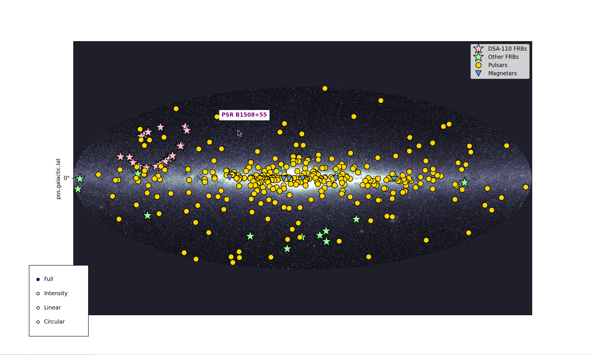

# dynamicradiosky

This is an interactive map of the transient radio sources in our Galaxy and beyond! Running the demo will display a map of the Galaxy with pulsar, Fast Radio Burst (FRB), and magnetar positions highlighted. When you click on each source, you'll hear a "sonified" version of the data detected by radio telescopes. You can learn more about pulsars, FRBs, magnetars, and more in, ["Pulsars, Magnetars, and Fast Radio Bursts! Radio Waves from Our Galaxy...And Beyond!"](https://mylesbsherman.com/wp-content/uploads/2025/09/explorecaltechbooklet_right.pdf), a pamphlet about radio astronomy by Myles Sherman. This demo uses data compiled from the [Australia Telescope National Facility (ATNF)](https://www.atnf.csiro.au/research/pulsar/psrcat/) pulsar catalog ([Hobbs et al., 2004](https://ui.adsabs.harvard.edu/scan/manifest/2004IAUS..218..139H)), [the DSA-110 FRB sample](http://code.deepsynoptic.org/dsa110-archive) ([Law et al., 2024](https://iopscience.iop.org/article/10.3847/1538-4357/ad3736/meta)), [the CHIME FRB Catalog](https://www.chime-frb.ca/catalog) ([CHIME/FRB Collaboration et al., 2021](https://iopscience.iop.org/article/10.3847/1538-4365/ac33ab/meta); [CHIME/FRB Collaboration et al., 2026](https://iopscience.iop.org/article/10.3847/1538-4365/ae3828/meta)), [the McGill Magnetar Catalog](https://www.physics.mcgill.ca/~pulsar/magnetar/main.html) ([Olausen & Kaspi](https://iopscience.iop.org/article/10.1088/0067-0049/212/1/6/meta)), and references in Table 4 of [Sherman et al., 2024](https://iopscience.iop.org/article/10.3847/1538-4357/ad275e/meta#apjad275et4). Please cite the original papers when using any data from this repository.


To run the demo, first clone or download the repository by opening a terminal and running:

```bash
git clone git@github.com:mbsherma/dynamicradiosky.git
```

or, if downloading, click Code>Download ZIP and unzip the repository. Then in the terminal:

```bash
cd dynamicradiosky
python demo.py
```

This will open the interactive map; a screenshot is shown below as an example:



